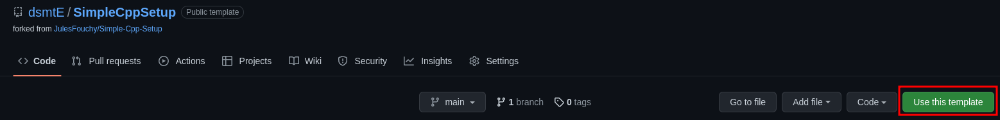
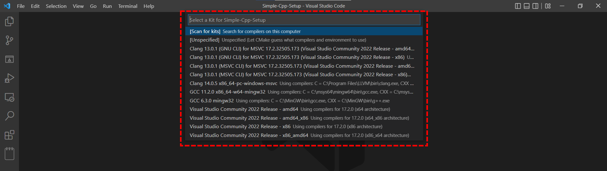

# Simple Cpp Setup

🎉 Welcome to this simple C++ template project!<br/>
👩‍💻 It contains everything you need to get started with programming in C++.

This is a fork from the great template of Jules Fouchy that you can find [here](https://github.com/JulesFouchy/Simple-Cpp-Setup)

If your machine is already setup and can compile C++ code, you can jump to [Creating a repository](#creating-a-repository).

- [Simple Cpp Setup](#simple-cpp-setup)
  - [Installing the tools](#installing-the-tools)
    - [IDE](#ide)
    - [CMake](#cmake)
  - [Creating a repository](#creating-a-repository)
  - [Downloading the repository on your computer](#downloading-the-repository-on-your-computer)
  - [Running the code](#running-the-code)
  - [Writing code](#writing-code)

## Installing the tools

### IDE

We recommend using Visual Studio Code as your IDE (Integrated Development Environment). [You can download it from here.](https://code.visualstudio.com/)

Then you will need the C++ extensions: [ms-vscode.cpptools-extension-pack](https://marketplace.visualstudio.com/items?itemName=ms-vscode.cpptools-extension-pack).

### CMake

Install CMake from https://cmake.org/download/ (or from your favorite package manager).

## Creating a repository

Make a copy of this repository on your own GitHub account by using `Use this template`.


> **NB:** If you are not using GitHub but GitLab or anything else, just download the code (using the `Code` dropdown next to `Use this template`), then create a repo on your own, and commit the downloaded code to that repo. `Use this template` is just a convenient shortcut, it is not mandatory.

## Downloading the repository on your computer

Open a terminal in the folder where you want to download this repository, and run:
```bash
git clone [url to the repository you just created]
```

For example in my case this would be:
```bash
git clone https://github.com/dsmtE/SimpleCppSetup
```

## Running the code

Open the folder in Visual Studio Code. You should then see something like:


In the bottom section, click the `Run` (triangle) button:


> 💡 If the `Run` button isn't there, it is probably because you did not open the right folder. Maybe you opened the parent of the folder containing the project? Check that in the folder view (framed in red in the previous picture) you have a `CMakeLists.txt` at the root.
If this wasn't the problem, then maybe you didn't install the C++ extensions, or you just need to close and re-open VS Code for the changes to take effect.

The first time, it will ask you which compiler you want to use. You might need to click `Scan for kits`. Then, if you installed everything correctly, you should have at least one in the list. Select one that talks about 64 bit architecture.



Your program should then compile, run, and output "Hello World!"


🎉 **Congrats, you are now ready to start coding!**

## Writing code

Put all your C++ files (*.cpp* and *.hpp*) in the `src` folder.
This is where the `CMakeLists.txt` is configured to look for them.


## Details
Ne compléter que la fonction construction


Trier les points selon x
    std::sort(app.points.begin(), app.points.end(), compareCoords);

Vider la liste existante de triangles
Créer un trés grand triangle (-1000, -1000); (500, 3000); (1500, -1000)
    Le rajouter à la liste de triangles déjà créés

Pour chaque point P du repère:
    créer une liste de segments LS
    Pour chaque triangle T déjà créé:
        tester si le cercle circonscrit contient le point P
        Dans ce cas:
            Récupérer les différents segments de ce triangles dans LS
            Enlever le triangke T de la liste 

    Pour chaque segment S de la liste LS:
        si un segment partage ses points avec d'autres segments
        (segment1.p1 == segment2.p2) && (segment1.p2 == segment2.p1)
        Dans ce cas:
            le virer

    Pour chaque segment S de la liste LS:
        créer un nouveau triangle composé du segment S et du point P